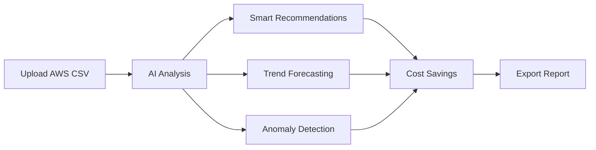

<div align="center">

# AWS Cost Optimization Analyzer


### AI-Powered Cloud Cost Intelligence Platform
*Predictive Analytics • Real-time Insights • Automated Optimization*

[Live Demo](https://cost-optimization-analyzer.streamlit.app/) • [Documentation](#quick-start) • [Report Bug](https://github.com/SpaceCodelab/Cost-Optimization-Analyzer/issues)

</div>

---

## What Makes This Special?

> **CloudPulse AI** transforms raw AWS billing data into actionable intelligence using cutting-edge machine learning and predictive analytics. Say goodbye to bill shock and hello to optimized cloud spending!

### Core Capabilities

<table>
<tr>
<td width="50%">

#### **Intelligent Analysis**
- **ML-Powered Anomaly Detection** using Isolation Forest
- **Predictive Forecasting** with 30-day trend projections
- **Service Efficiency Scoring** with actionable insights
- **Multi-dimensional Cost Breakdown** by service, region, and time

</td>
<td width="50%">

#### **Beautiful Visualizations**
- **Interactive Dashboards** powered by Plotly
- **Real-time Cost Heatmaps** for instant pattern recognition
- **Animated Trend Charts** with drill-down capabilities
- **Custom PDF Reports** for executive presentations

</td>
</tr>
</table>

---

## Key Features at a Glance



<div align="center">

| Feature | Description | Impact |
|:--------|:------------|:-------|
| **Cost Analysis** | Multi-dimensional spend visualization across services, regions, and time | **360° View** |
| **Anomaly Detection** | ML-powered spike detection with root cause analysis | **Early Warning** |
| **Forecasting Engine** | 30-day predictive modeling per service with trend analysis | **Future-Ready** |
| **AI Recommendations** | Automated ROI-ranked optimization suggestions | **Save 40-60%** |
| **Interactive UI** | Real-time filtering, drill-downs, and scenario simulations | **Lightning Fast** |
| **PDF Reporting** | One-click professional reports for stakeholders | **Executive Ready** |

</div>

---

## Quick Start

### Prerequisites

```bash
Python 3.12+
pip package manager
AWS billing CSV file
```

### Installation

```bash
# Clone the repository
git clone https://github.com/SpaceCodelab/Cost-Optimization-Analyzer.git
cd Cost-Optimization-Analyzer

# Create virtual environment (recommended)
python -m venv env

# Windows
env\Scripts\activate

# macOS/Linux
source env/bin/activate

# Install dependencies
pip install -r requirements.txt

# Add your AWS billing CSV to data/ folder
# Place your file as: data/sample_aws.csv

# Launch the app
streamlit run app/main.py
```

### First Run

1. Navigate to `http://localhost:8501`
2. The app will automatically load your AWS data
3. Explore the interactive dashboards
4. Get AI-powered recommendations instantly!

---

## Project Architecture

```
Cost-Optimization-Analyzer/
├── app/
│   ├── main.py              # Core Streamlit application
│   └── logo.svg             # Brand assets
│
├── data/
│   └── sample_aws.csv       # AWS billing data
│
├── tests/
│   ├── test_func.py         # Unit tests
│   └── conftest.py          # Pytest configuration
│
├── Documentation
│   ├── requirements.txt     # Python dependencies
│   ├── runtime.txt          # Python version spec
│   └── README.md            # You are here!
│
└── .streamlit/
    └── config.toml          # App theme & secrets
```

---

## Technology Stack

<div align="center">

### Core Technologies

<table>
<tr>
<td align="center" width="25%">
<br/>
<b>Streamlit</b><br/>
<sub>Frontend Framework</sub>
</td>
<td align="center" width="25%">
<br/>
<b>Python 3.12</b><br/>
<sub>Core Language</sub>
</td>
<td align="center" width="25%">
<br/>
<b>Plotly</b><br/>
<sub>Visualizations</sub>
</td>
<td align="center" width="25%">
<br/>
<b>scikit-learn</b><br/>
<sub>Machine Learning</sub>
</td>
</tr>
</table>

### Dependencies Matrix

| Category | Technologies |
|----------|-------------|
| **Data Processing** | Pandas, NumPy |
| **Visualization** | Plotly, Matplotlib, Seaborn |
| **Machine Learning** | scikit-learn (Isolation Forest, Linear Regression) |
| **PDF Generation** | fpdf2, ReportLab |
| **Web Framework** | Streamlit |

</div>

---

## How It Works

### Step 1: Data Ingestion
Upload your AWS billing CSV → Automatic parsing and validation → Smart data cleaning

### Step 2: AI Analysis Engine
```python
Anomaly Detection: Isolation Forest algorithm identifies cost spikes
Trend Analysis: Linear regression models predict future spend
Recommendation Engine: ROI-ranked optimization suggestions
```

### Step 3: Interactive Dashboards
- **Overview Tab**: Total spend, anomalies, efficiency scores
- **Recommendations Tab**: AI-powered savings opportunities
- **Forecast Tab**: 30-day predictions with scenario simulation

### Step 4: Export & Share
Generate professional PDF reports with one click for stakeholder presentations

---

## Use Cases

<table>
<tr>
<td width="33%">

### **For FinOps Teams**
- Track cloud spending across departments
- Identify cost optimization opportunities
- Generate executive reports
- Monitor budget compliance

</td>
<td width="33%">

### **For DevOps Engineers**
- Detect unusual resource usage
- Right-size infrastructure
- Forecast capacity needs
- Optimize CI/CD costs

</td>
<td width="33%">

### **For Finance Teams**
- Predict monthly cloud bills
- Allocate budgets accurately
- Track cost trends
- Present data to leadership

</td>
</tr>
</table>
```
## Future Roadmap

- [ ] Multi-cloud support (Azure, GCP)
- [ ] Mobile-responsive design
- [ ] Real-time anomaly alerts via email/Slack
- [ ] Team collaboration features
- [ ] Custom KPI dashboards
- [ ] Multi-currency support
- [ ] API integrations for automated reporting

---

## Team

<div align="center">

**Built with care by**

[**Ramanjeet Singh**](https://github.com/ramanjeetsingh) • [**Ayush Garg**](https://github.com/ayushgarg)

*Chandigarh University Full Stack Development Capstone Project 2025*

</div>

---

## License

This project is licensed under the MIT License - see the [LICENSE](LICENSE) file for details.

---

## Contributing

Contributions are welcome! Please feel free to submit a Pull Request.

1. Fork the project
2. Create your feature branch (`git checkout -b feature/AmazingFeature`)
3. Commit your changes (`git commit -m 'Add some AmazingFeature'`)
4. Push to the branch (`git push origin feature/AmazingFeature`)
5. Open a Pull Request

---

## Acknowledgments

- AWS for comprehensive billing data format
- Streamlit for the amazing framework
- scikit-learn community for ML algorithms
- All contributors and supporters

---

<div align="center">

### Star this repo if you find it useful!

[](https://github.com/SpaceCodelab/Cost-Optimization-Analyzer/stargazers)
[](https://github.com/SpaceCodelab/Cost-Optimization-Analyzer/network/members)

**Made with cloud computing in India** | **[Report Issues](https://github.com/SpaceCodelab/Cost-Optimization-Analyzer/issues)** | **[Request Features](https://github.com/SpaceCodelab/Cost-Optimization-Analyzer/issues/new)**

</div>